cargo build
cargo build --release 
<!--  produces a static library (libstark_password_proof.a). -->
cc check_ffi.c target/release/libstark_password_proof.a -lpthread -ldl -lm -o check_ffi && ./check_ffi
cargo check
cargo test
wasm-pack build --target web
python3 -m http.server 8000

```mermaid
graph TD
    %% --- STYLE DEFINITIONS ---
    classDef client fill:#eef2ff,stroke:#4f46e5,stroke-width:2px;
    classDef wasm fill:#fff1f2,stroke:#be123c,stroke-width:2px;
    classDef lib fill:#f0fdf4,stroke:#15803d,stroke-width:1px,stroke-dasharray: 5 5;
    classDef db fill:#fefce8,stroke:#a16207,stroke-width:2px;

    %% --- CLIENT LAYER ---
    subgraph Client ["🖥️ Client (Browser / JS)"]
        UI[User Interface<br/> HTML/CSS]:::client
        JS[JS Controller<br/> State Mgmt]:::client
    end

    %% --- WASM LAYER ---
    subgraph RustWasm ["🦀 Rust WASM Module"]
        direction TB
        
        subgraph PublicAPI ["Public API (wasm_bindgen)"]
            FnCommit[get_commitment]:::wasm
            FnProve[prove_password]:::wasm
            FnVerify[verify_password_proof]:::wasm
        end

        subgraph CoreLogic ["Internal Logic & Dependencies"]
            Argon2Lib[crate: rust-argon2]:::lib
            PoseidonLib[crate: Poseidon2]:::lib
            
            subgraph ZKEngine ["Plonky3 ZK Engine"]
                TraceGen[Trace Generator<br/> x → x² + 5]:::lib
                AirDef[AIR Constraints]:::lib
                P3Prover[STARK Prover]:::lib
                P3Verifier[STARK Verifier]:::lib
            end
        end

        %% Internal Rust Wiring
        FnCommit --> Argon2Lib
        Argon2Lib --> PoseidonLib
        
        FnProve --> Argon2Lib
        Argon2Lib --> TraceGen
        TraceGen --> P3Prover
        AirDef -.-> P3Prover
        
        FnVerify --> P3Verifier
        AirDef -.-> P3Verifier
        PoseidonLib -.-> P3Prover & P3Verifier
    end

    %% --- DATA LAYER ---
    subgraph Backend ["☁️ Backend / Storage"]
        DB[(User Database<br/>Commitment + Salt)]:::db
    end

    %% --- DATA FLOWS ---
    UI <--> JS

    %% 1. Registration Flow
    JS -- "1. Pass (String)" --> FnCommit
    FnCommit -- "Commitment (u64)" --> JS
    JS -- "Store" --> DB

    %% 2. Proving Flow
    JS -- "2. Pass + Salt + Nonce" --> FnProve
    FnProve -- "Proof (Bytes)" --> JS

    %% 3. Verification Flow
    JS -- "3. Proof + Commitment + Nonce" --> FnVerify
    FnVerify -- "Result (bool)" --> JS
    
    %% DB Read
    DB -. "Fetch Salt/Commitment" .-> JS
```

